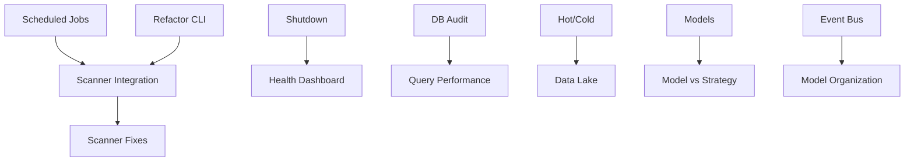

# AI Trading System - Issue Registry

**Created**: 2025-08-08  
**Updated**: 2025-01-10 (Phase 2.5 Risk Management Analysis)  
**Source**: current_issues.txt + system analysis + Phase 2 testing + Risk Management fixes  
**Total Issues**: 58+ (27 primary, 31+ sub-issues)  

---

## Issue Tracking Summary

| Priority | Count | Status |
|----------|-------|--------|
| P0 - Critical | 8 | 🔴 Blocking (3 NEW from testing) |
| P1 - High | 17 | 🟡 Major Impact (5 NEW from risk_management) |
| P2 - Medium | 18 | 🟡 Performance |
| P3 - Low | 15+ | 🔵 Maintenance |

## 🔴 SYSTEM STATUS: NON-FUNCTIONAL
Phase 2 testing on 2025-08-08 revealed the system is completely non-operational.
9 out of 10 major components failed basic initialization tests.

---

## P0 - Critical Issues (System Breaking)

### 🆕 ISSUE-NEW-001: Configuration System Broken (BLOCKER)
- **Component**: config/
- **Impact**: Blocks entire system - nothing can initialize
- **Status**: 🔴 Open
- **Discovered**: Phase 2 Testing (2025-08-08)
- **Description**: System expects `unified_config.yaml` which doesn't exist
- **Actual Files**: app_context_config.yaml, layer_definitions.yaml, event_config.yaml, etc.
- **Required Action**: 
  1. Fix config loader to use correct filenames
  2. OR create unified_config.yaml
  3. This MUST be fixed first

### 🆕 ISSUE-NEW-002: Missing OrderError Exception
- **Component**: utils/exceptions.py
- **Impact**: Blocks trading_engine and jobs modules
- **Status**: 🔴 Open
- **Discovered**: Phase 2 Testing (2025-08-08)
- **Error**: `cannot import name 'OrderError' from 'main.utils.exceptions'`
- **Required Action**: Add OrderError class to exceptions.py

### 🆕 ISSUE-NEW-003: System-Wide Import Failures
- **Component**: Multiple
- **Impact**: 9/10 components cannot initialize
- **Status**: 🔴 Open
- **Discovered**: Phase 2 Testing (2025-08-08)
- **Missing Classes/Functions**:
  - ExposureLimitChecker (risk_management)
  - SystemDashboard (monitoring)
  - get_scanner_registry (scanners)
  - polygon_client module path incorrect
- **Required Action**: Fix all missing imports

### ISSUE-001: Scheduled Jobs Broken ✅ CONFIRMED
- **Component**: orchestration/jobs
- **Impact**: No automation, manual intervention required
- **Status**: 🔴 Open
- **Description**: Scheduled jobs are not executing
- **Required Action**: 
  1. Debug job scheduler
  2. Fix cron/schedule configuration
  3. Test all job types
  4. Implement monitoring

### ISSUE-002: Scanner Execution Not Integrated ✅ CONFIRMED
- **Component**: scanners/, app/ai_trader.py
- **Impact**: Cannot run scanners from main entry point
- **Status**: 🔴 Open
- **Confirmed**: Phase 2 Testing - get_scanner_registry missing
- **Description**: New scanner pipeline not accessible via CLI
- **Required Action**:
  1. Add scanner commands to ai_trader.py
  2. Integrate with layer management
  3. Test end-to-end flow

### ISSUE-003: Graceful Shutdown Broken
- **Component**: app/, monitoring/dashboards
- **Impact**: Data corruption risk, poor UX
- **Status**: 🔴 Open
- **Description**: System doesn't shut down cleanly
- **Dashboard Issue**: Keyboard interrupt doesn't work
- **Required Action**:
  1. Implement signal handlers
  2. Add cleanup routines
  3. Fix dashboard shutdown
  4. Test with all components running

### ISSUE-004: Database Execute Audit Findings
- **Component**: data_pipeline/storage
- **Impact**: Data integrity risk
- **Status**: 🔴 Open
- **Reference**: docs/reports/database_execute_audit.md
- **Required Action**:
  1. Review audit findings
  2. Fix execute operations
  3. Add proper error handling
  4. Update documentation

### ISSUE-005: System Health Dashboard Empty ✅ CONFIRMED
- **Component**: monitoring/dashboards
- **Impact**: No system visibility
- **Status**: 🔴 Open
- **Confirmed**: Phase 2 Testing - SystemDashboard class doesn't exist
- **Description**: System health tab shows no data
- **Required Action**:
  1. Connect health metrics
  2. Implement data collection
  3. Fix dashboard rendering

---

## P1 - High Priority Issues (Major Functionality)

### ISSUE-006: Scanners Not Working Properly
- **Component**: scanners/
- **Impact**: Symbol selection broken
- **Status**: 🟡 Open
- **Description**: Multiple scanner issues reported
- **Sub-issues**:
  - Layer qualification logic
  - Scanner execution timing
  - Result persistence
  - Integration with universe management

### ISSUE-007: Hot/Cold Storage Routing Incomplete
- **Component**: data_pipeline/storage
- **Impact**: Inefficient storage, performance issues
- **Status**: 🟡 Partially Done
- **Description**: Hot data routing to DB not fully implemented
- **Questions**:
  - What data belongs in hot storage?
  - When should data move to cold?
  - How to handle transitions?

### ISSUE-008: Model Training Confusion
- **Component**: models/
- **Impact**: Unclear model usage
- **Status**: 🟡 Open
- **Questions**:
  - What does "trained model on AAPL" mean?
  - Which models need per-symbol training?
  - How to manage model lifecycle?
- **Sub-issues**:
  - ISSUE-008a: Model inventory needed
  - ISSUE-008b: Training pipeline unclear
  - ISSUE-008c: Model-symbol mapping missing

### ISSUE-009: API Connection Timeouts
- **Component**: data_pipeline/ingestion
- **Impact**: Data gaps, reliability issues
- **Status**: 🟡 Open
- **Error Log Examples**:
  ```
  01:27:22 WARNING APIClient Connection timeout to data source
  00:40:46 ERROR APIClient Connection timeout to data source
  ```

### ISSUE-010: Circuit Breaker Over-Triggering
- **Component**: risk_management/
- **Impact**: False positives blocking trades
- **Status**: 🟡 Open
- **Error Log Examples**:
  ```
  01:21:36 WARNING RiskManager Circuit breaker triggered for high volatility
  00:42:46 ERROR RiskManager Circuit breaker triggered for high volatility
  ```

### ISSUE-011: Feature Calculation Delays
- **Component**: feature_pipeline/
- **Impact**: Stale signals, missed opportunities
- **Status**: 🟡 Open
- **Error Log Examples**:
  ```
  01:00:36 ERROR FeatureEngine Feature calculation delayed
  00:33:24 WARNING TradingEngine Feature calculation delayed
  ```

### ISSUE-012: ai_trader.py Too Large
- **Component**: app/ai_trader.py
- **Impact**: Maintainability, debugging difficulty
- **Status**: 🟡 Open
- **Description**: Main entry point needs refactoring
- **Required Action**:
  1. Split into command modules
  2. Create command registry
  3. Improve error handling

---

## P2 - Medium Priority Issues (Performance/Quality)

### ISSUE-013: Database Query Performance
- **Component**: data_pipeline/storage
- **Impact**: System slowdown
- **Status**: 🟡 Open
- **Error Log**: `00:34:51 INFO FeatureEngine Database query slow: 523ms`
- **Target**: <100ms for most queries

### ISSUE-014: Sentiment Analysis Wrong Location
- **Component**: monitoring/dashboards
- **Impact**: Poor UX
- **Status**: 🟡 Open
- **Description**: Should be on trading dashboard, not system

### ISSUE-015: Model Directory Organization
- **Component**: models/
- **Impact**: Confusion, maintenance difficulty
- **Status**: 🟡 Open
- **Questions**:
  - Purpose of specialists/ folder?
  - Purpose of outcome_classifier_helpers/?
  - Why monitoring/ under models/?
  - Purpose of event_driven/ folder?
  - Purpose of hft/ folder?
  - Purpose of utils/ in models/?

### ISSUE-016: Backtesting Module Usage
- **Component**: backtesting/
- **Impact**: Potential dead code
- **Status**: 🟡 Open
- **Questions**:
  - Is analysis/ folder used?
  - Is engine/ folder used?
  - Is optimization/ folder used?
  - Why factories.py here?
  - Is run_system_backtest.py used?

### ISSUE-017: Core Directory Purpose
- **Component**: core/
- **Impact**: Unclear architecture
- **Status**: 🟡 Open
- **Description**: Purpose and usage unclear

### ISSUE-018: Event Bus Deprecation
- **Component**: events/
- **Impact**: Dead code, confusion
- **Status**: 🟡 Open
- **Description**: Suspected deprecated code from event bus refactoring

### ISSUE-019: Data Lake Efficiency
- **Component**: data_pipeline/storage/archive
- **Impact**: Storage costs, performance
- **Status**: 🟡 Open
- **Questions**:
  - Keep all 10k symbols in raw storage?
  - Only keep scanner-identified symbols?
  - Value of non-scanner symbols?

---

## P3 - Low Priority Issues (Code Quality)

### ISSUE-020: Missing Macroeconomic Dashboard
- **Component**: monitoring/dashboards
- **Impact**: Feature request
- **Status**: 🔵 Open
- **Description**: Want macro indicators on trading dashboard

### ISSUE-021: Polygon/Alpaca Data Underutilized
- **Component**: data_pipeline/ingestion
- **Impact**: Missing opportunities
- **Status**: 🔵 Open
- **Question**: Are we using all available data?

### ISSUE-022: Model vs Strategy Confusion
- **Component**: models/, documentation
- **Impact**: Conceptual clarity
- **Status**: 🔵 Open
- **Description**: Need clear distinction documented

### ISSUE-023: Order Rejection Handling
- **Component**: trading_engine/
- **Impact**: Error handling
- **Status**: 🔵 Open
- **Error Log**: `01:00:22 INFO RiskManager Order rejected by broker`

### ISSUE-024: Documentation Updates Needed
- **Component**: docs/
- **Impact**: Maintenance
- **Status**: 🔵 Open
- **Description**: Event documentation needs updating after refactoring

### ISSUE-025: Duplicate Factory Patterns
- **Component**: Multiple
- **Impact**: Code duplication
- **Status**: 🔵 Open
- **Description**: Multiple factories.py files found

---

## Issue Dependencies



---

## Resolution Roadmap

### Week 1: Critical Fixes
- [ ] ISSUE-001: Fix scheduled jobs
- [ ] ISSUE-002: Integrate scanner execution
- [ ] ISSUE-003: Implement graceful shutdown
- [ ] ISSUE-004: Address database audit findings
- [ ] ISSUE-005: Fix system health dashboard

### Week 2: High Priority
- [ ] ISSUE-006: Fix all scanners
- [ ] ISSUE-007: Complete hot/cold routing
- [ ] ISSUE-009: Fix API timeouts
- [ ] ISSUE-010: Tune circuit breakers
- [ ] ISSUE-011: Optimize feature calculation

### Week 3: Refactoring
- [ ] ISSUE-012: Refactor ai_trader.py
- [ ] ISSUE-018: Remove event bus code
- [ ] ISSUE-025: Consolidate factories

### Week 4: Organization
- [ ] ISSUE-008: Document model system
- [ ] ISSUE-015: Reorganize models directory
- [ ] ISSUE-016: Clean backtesting module
- [ ] ISSUE-017: Clarify core directory

### Week 5: Optimization
- [ ] ISSUE-013: Optimize queries
- [ ] ISSUE-019: Optimize data lake
- [ ] ISSUE-021: Maximize API usage

### Week 6: Enhancement
- [ ] ISSUE-014: Move sentiment analysis
- [ ] ISSUE-020: Add macro dashboard
- [ ] ISSUE-024: Update documentation

---

## Tracking Metrics

### Issue Status
- 🔴 Critical: 5 open, 0 fixed
- 🟡 High: 12 open, 0 fixed
- 🟡 Medium: 18 open, 0 fixed
- 🔵 Low: 15+ open, 0 fixed

### Progress Indicators
- Issues Identified: 50+
- Issues Documented: 25
- Issues In Progress: 0
- Issues Resolved: 0
- Tests Added: 0

---

## Notes

### Patterns Observed
1. Multiple issues related to incomplete refactoring (event bus)
2. Performance issues across multiple components
3. Dashboard/UI issues indicate frontend-backend disconnect
4. Model management system needs complete overhaul
5. Storage strategy needs optimization

### Risk Assessment
- **High Risk**: Database operations, graceful shutdown
- **Medium Risk**: Scanner reliability, model training
- **Low Risk**: UI improvements, documentation

---

## 🆕 Phase 2.5 - Risk Management Module Issues (2025-01-10)

### Summary of Fixes Applied
During the session on 2025-01-10, we identified and fixed critical import issues in the risk_management module:

#### ✅ FIXED Issues:
1. **CircuitBreakerType → BreakerType**: Fixed incorrect class name references throughout circuit_breaker module
2. **Added BreakerPriority enum**: Was referenced but not defined in types.py
3. **RiskAlertLevel alias**: Added backward compatibility alias for RiskLevel
4. **StopLossManager → DynamicStopLossManager**: Fixed class name mismatches
5. **Missing config classes**: Added RiskMonitorConfig, MonitoringAlert dataclasses
6. **Dataclass inheritance issues**: Fixed default field ordering in circuit breaker events

### 🔴 NEW P1 Issues - Missing Implementations

#### ISSUE-RM-001: Circuit Breaker Manager Classes Missing
- **Component**: risk_management/real_time/circuit_breaker
- **Impact**: Circuit breaker system incomplete
- **Status**: 🔴 Open
- **Missing Classes**:
  - BreakerEventManager
  - BreakerStateManager
- **Location**: Referenced in registry.py but not implemented

#### ISSUE-RM-002: Position Sizing Modules Missing
- **Component**: risk_management/position_sizing
- **Impact**: Cannot use advanced position sizing strategies
- **Status**: 🔴 Open
- **Missing Modules**:
  - kelly_position_sizer.py (KellyPositionSizer)
  - volatility_position_sizer.py (VolatilityPositionSizer)
  - optimal_f_sizer.py (OptimalFPositionSizer)
  - base_sizer.py (BasePositionSizer)
  - portfolio_optimizer.py
  - risk_parity_sizer.py
  - dynamic_sizer.py
- **Current State**: Only var_position_sizer.py exists

#### ISSUE-RM-003: Risk Metrics Calculators Missing
- **Component**: risk_management/metrics
- **Impact**: Cannot calculate risk metrics
- **Status**: 🔴 Open
- **Missing Modules**:
  - risk_metrics_calculator.py
  - portfolio_metrics.py
  - position_metrics.py
  - var_calculator.py
  - cvar_calculator.py
  - ratio_calculators.py
  - drawdown_analyzer.py
  - correlation_analyzer.py
  - liquidity_metrics.py
  - stress_testing.py
- **Current State**: Only __init__.py with placeholder classes

#### ISSUE-RM-004: Post-Trade Analysis Missing
- **Component**: risk_management/post_trade
- **Impact**: Cannot analyze trade performance
- **Status**: 🔴 Open
- **Missing Modules**:
  - post_trade_analyzer.py
  - trade_review.py
  - risk_performance.py
  - compliance_checker.py
  - reconciliation.py
  - reporting.py
  - analytics.py
- **Current State**: Only __init__.py with placeholder classes

#### ISSUE-RM-005: Real-Time Components Incomplete
- **Component**: risk_management/real_time
- **Impact**: Missing risk management features
- **Status**: 🟡 Medium
- **Missing Classes**:
  - DrawdownConfig, DrawdownAction (drawdown_control.py)
  - StopLossConfig, TrailingStopLoss (stop_loss.py)
  - LiquidationOrder, EmergencyLiquidation (position_liquidator.py)

### 📊 Risk Management Module Status
- **Files**: 47 total Python files
- **Functional**: ~60% (core functionality works)
- **Missing**: ~40% (advanced features not implemented)
- **Placeholder Classes**: 15+ (added to prevent import errors)

### Required Actions
1. **Priority 1**: Implement BasePositionSizer - blocks trading engine integration
2. **Priority 2**: Implement risk metrics calculators - needed for monitoring
3. **Priority 3**: Complete circuit breaker system components
4. **Priority 4**: Add post-trade analysis modules

---

*Last Updated: 2025-08-08*  
*Registry Version: 1.0*